# Architecture Note

## Purpose

This project started as a proof-of-concept dashboard for a single public Yutori scout focused on university AI initiatives. The current product works, but the long-term goal is broader: a reusable sector intelligence platform that can ingest many sources, extract structured strategic events, resolve them into canonical entities and event records, score their significance, and generate dashboards and periodic reports.

This note documents:

- the current architecture in this repo
- the target architecture for a generalized sector intelligence system
- the core data contracts the platform should obey
- the recommended refactor path from the current proof of concept

## Current State

Today the app is a Next.js presentation layer that also performs source fetching, parsing, heuristic extraction, and dashboard shaping at request time.

Current responsibilities are concentrated in two places:

- `src/lib/yutori.ts`
  - hardcodes a single Yutori scout ID
  - fetches `/updates` and `/non_updates`
  - parses digest HTML into initiative-like rows
  - infers categories and counts using higher-ed-specific heuristics
- `src/app/page.tsx`
  - converts parsed updates into metrics, category mix, institution counts, and monthly timeline cards
  - deduplicates initiatives using an `institution|title` key for display

This is a good proof of concept, but it tightly couples four separate concerns:

1. source access
2. raw document capture
3. event extraction
4. dashboard view modeling

That coupling is the main thing to unwind.

## North Star

Build a sector intelligence kernel with a higher-ed report on top of it.

Do not treat prose digests as the database. Treat them as one possible output format.

The system should support:

- multiple source types
- multiple sectors and industry configurations
- replayable extraction over stored raw documents
- auditable evidence trails from report claims back to source text
- reusable reporting patterns across sectors

## Design Principles

### Separate immutable facts from derived judgments

Facts should include:

- who acted
- what changed
- when it was announced or became effective
- where it happened
- scale or magnitude
- what source text supports the claim

Derived judgments should include:

- significance
- novelty
- follow-up priority
- scenario implications

These should be stored separately so the scoring layer can evolve without rewriting facts.

### Preserve every layer

Do not collapse source documents directly into final events.

The platform should preserve:

1. raw document
2. event observation from that document
3. canonical strategic event after clustering and dedupe

That separation makes backfills, prompt changes, and QA much easier.

### Keep the core model narrow and stable

The core event schema should work across sectors.

Sector-specific details should live in:

- `subtype`
- extension payloads
- sector-specific report logic

Avoid putting healthcare-, energy-, finance-, or higher-ed-only fields directly into the universal event contract unless they are truly cross-sector.

### Treat sector as configuration, not hardcoded logic

Higher ed should become one `SectorConfig`, not the ontology of the app.

## Target Architecture

```mermaid
flowchart LR
  A["Sources / APIs / Feeds"] --> B["Source Adapters"]
  B --> C["Raw Document Store"]
  C --> D["Extraction Pipeline"]
  D --> E["Event Observations"]
  E --> F["Entity Resolution + Dedupe"]
  F --> G["Canonical Strategic Events"]
  G --> H["Assessment + Scoring"]
  H --> I["Sector Snapshots / Reports"]
  I --> J["Next.js Dashboard"]
```



### Layer Responsibilities

#### 1. Source adapters

Adapters know how to fetch and normalize external source payloads.

Examples:

- Yutori updates
- SEC EDGAR feeds
- Federal Register endpoints
- RSS feeds
- newsroom archives
- procurement and grant sources

Adapters should output `Document` records and never contain sector-specific analysis logic.

#### 2. Raw document store

The raw document store is the replay layer.

It should preserve:

- raw payload
- normalized text
- canonical URL
- content hash
- fetch timestamps
- source metadata

If extraction improves later, the system should re-run extraction from stored documents instead of recollecting the web.

#### 3. Extraction pipeline

The extraction pipeline turns documents into `EventObservation` records.

Each observation represents one event claim found in one document.

One document may yield:

- zero events
- one event
- many events

This matches the current higher-ed proof of concept, where one Yutori update can contain several initiatives in one digest.

#### 4. Entity resolution and dedupe

This layer maps names to canonical entities and clusters repeated coverage into canonical strategic events.

The goal is to distinguish:

- repeated reporting on the same event
- materially new events
- genuine status changes for an existing event

#### 5. Assessment and scoring

This layer computes:

- significance
- novelty
- follow-up priority
- source quality
- scenario tags

These values should be versioned and recomputable.

#### 6. Sector snapshots and reports

The reporting layer aggregates canonical events into reusable sector views such as:

- weekly digest
- monthly sector memo
- quarterly deep dive
- dashboard snapshot

The Next app should read these prepared view models instead of doing extraction or clustering on demand.

## Core Domain Model

The system should start with these domain contracts:

- `Document`
- `EventObservation`
- `StrategicEvent`
- `Entity`
- `SectorConfig`
- `EventAssessment`
- `SectorSnapshot`

### `Document`

Represents an immutable source item captured by the system.

Suggested fields:

```ts
export interface Document {
  id: string;
  adapter: string;
  source_type: "api" | "rss" | "html" | "pdf" | "json";
  canonical_url: string;
  title?: string;
  published_at?: string;
  discovered_at: string;
  fetched_at: string;
  content_hash: string;
  raw_payload: unknown;
  extracted_text?: string;
  source_authority?: "official" | "company" | "trade" | "news" | "wire";
  metadata?: Record<string, unknown>;
}
```

### `EventObservation`

Represents one event claim extracted from one document.

Suggested fields:

```ts
export interface EventObservation {
  id: string;
  document_id: string;
  event_type: EventType;
  subtype?: string;
  primary_sector_code?: string;
  related_sector_codes?: string[];
  industry_code?: string;
  actors: Array<{
    name: string;
    role: "company" | "regulator" | "customer" | "supplier" | "partner" | "investor" | "institution";
    entity_id?: string;
  }>;
  announced_at?: string;
  effective_at?: string;
  geography?: {
    country?: string;
    state?: string;
    metro?: string;
    city?: string;
  };
  magnitude?: {
    amount?: number;
    currency?: string;
    jobs?: number;
    capacity?: string;
    contract_value?: number;
  };
  summary: string;
  why_it_matters?: string;
  evidence: Array<{
    source_url: string;
    source_title?: string;
    sentence: string;
    published_at?: string;
  }>;
  confidence: number;
  extraction_run_id: string;
  schema_version: string;
  model_version?: string;
  extension_json?: Record<string, unknown>;
}
```

### `StrategicEvent`

Represents the canonical, clustered event built from one or more observations.

Suggested fields:

```ts
export interface StrategicEvent {
  id: string;
  canonical_key: string;
  event_type: EventType;
  subtype?: string;
  primary_sector_code?: string;
  related_sector_codes?: string[];
  industry_code?: string;
  actor_entity_ids: string[];
  first_seen_at: string;
  last_seen_at: string;
  announced_at?: string;
  effective_at?: string;
  current_status?: "announced" | "expanding" | "delayed" | "launched" | "completed" | "withdrawn";
  summary: string;
  extension_json?: Record<string, unknown>;
}
```

### `Entity`

Represents a canonical actor.

Suggested fields:

```ts
export interface Entity {
  id: string;
  name: string;
  entity_type:
    | "company"
    | "regulator"
    | "agency"
    | "university"
    | "hospital"
    | "nonprofit"
    | "supplier"
    | "investor";
  primary_sector_code?: string;
  related_sector_codes?: string[];
  geography?: {
    country?: string;
    state?: string;
    city?: string;
  };
  identifiers?: Record<string, string>;
}
```

### `SectorConfig`

Represents the configuration that routes documents and shapes extraction for a sector.

Suggested fields:

```ts
export interface SectorConfig {
  code: string;
  label: string;
  industry_codes?: string[];
  themes: string[];
  inclusion_rules: string[];
  exclusion_rules: string[];
  priority_sources: string[];
  seed_entities: string[];
  preferred_event_types: EventType[];
  significance_weights: Record<string, number>;
  extension_schema?: Record<string, unknown>;
}
```

### `EventAssessment`

Represents a versioned scoring pass over a canonical event.

Suggested fields:

```ts
export interface EventAssessment {
  id: string;
  strategic_event_id: string;
  significance_score: number;
  novelty_score?: number;
  follow_up_priority?: number;
  source_quality_score?: number;
  scenario_tags?: string[];
  rationale?: string;
  assessment_version: string;
  model_version?: string;
  created_at: string;
}
```

### `SectorSnapshot`

Represents a precomputed reporting payload for a sector and period.

Suggested fields:

```ts
export interface SectorSnapshot {
  id: string;
  sector_code: string;
  period_start: string;
  period_end: string;
  generated_at: string;
  summary: string;
  metrics: Record<string, number>;
  top_entities: Array<{ entity_id: string; label: string; value: number }>;
  top_event_types: Array<{ label: string; value: number }>;
  timeline: Array<{ label: string; value: number }>;
  report_payload: Record<string, unknown>;
}
```

## Event Type Taxonomy

Use a coarse cross-sector event taxonomy that can stay stable even as sectors expand:

```ts
export type EventType =
  | "strategy"
  | "regulation"
  | "product_launch"
  | "partnership"
  | "contract_award"
  | "funding"
  | "facility_capex"
  | "m_and_a"
  | "research_ip"
  | "pricing"
  | "workforce"
  | "recall_incident"
  | "litigation";
```

Sector-specific nuance should be handled via `subtype` and `extension_json`.

## Sector and Industry Taxonomy

The recommended backbone is:

- `primary_sector_code` for the main sector lens
- `related_sector_codes[]` for cross-sector spillover
- optional `industry_code` for more granular routing

For broad U.S.-first sector analysis, a NAICS-based taxonomy is a strong default. The platform should treat sector and industry codes as routing and reporting aids, not as the only way to represent relevance. Some entities, especially regulators and nonprofits, may not fit neatly into one industry code even though their actions matter to multiple sectors.

## Processing Flow

The default processing flow should be:

1. ingest raw source item
2. store immutable `Document`
3. classify relevance
4. route to sector and industry candidates
5. extract zero, one, or many `EventObservation` records
6. resolve entity names
7. cluster observations into `StrategicEvent`
8. compute `EventAssessment`
9. build `SectorSnapshot`
10. render dashboards and reports

## Storage Strategy

Use different stores for different jobs:

- Postgres for normalized records and queryable relationships
- blob storage for raw HTML, JSON, PDF, and text snapshots
- queue or workflow engine for ingestion and extraction jobs

### Recommended relational tables

- `sources`
- `documents`
- `document_fetches`
- `event_observations`
- `observation_evidence`
- `strategic_events`
- `event_entities`
- `entities`
- `event_assessments`
- `sector_configs`
- `sector_snapshots`

### Timestamps and replay fields

At a minimum, preserve:

- `published_at`
- `discovered_at`
- `fetched_at`
- `canonical_url`
- `content_hash`
- `schema_version`
- `model_version`
- `extraction_run_id`

These fields make replay and backfill practical.

## How the Current Higher-Ed Flow Fits

The current higher-ed implementation should be reinterpreted as follows:

- Yutori scout update -> `Document`
- bullet item parsed from digest -> `EventObservation`
- deduped initiative row in the table -> rough early version of `StrategicEvent`

This is already visible in the current code:

- `src/lib/yutori.ts` reconstructs initiative rows from update content
- `src/app/page.tsx` deduplicates by `institution|title` and uses the result for metrics and the table

That proof of concept validates the right grain choice: a single source document can yield many strategic events.

## Refactor Plan

Refactor in stages so the app stays usable while the architecture improves.

### Phase 1: establish generic core contracts

Add:

- `src/core/contracts.ts`
- `src/core/event-types.ts`
- `src/core/sector-config.ts`

Goal:

- move from higher-ed-specific types like `ParsedInitiative` and `ParsedUpdate`
- define reusable platform contracts

### Phase 2: make Yutori an adapter

Move Yutori-specific logic into a source adapter layer:

- `src/adapters/yutori/fetch.ts`
- `src/adapters/yutori/map-document.ts`
- `src/adapters/yutori/extract-observations.ts`

Goal:

- Yutori should emit documents and observations
- the rest of the app should stop depending on raw Yutori payload shape

### Phase 3: add persistence

Introduce storage for:

- raw documents
- event observations
- canonical events
- sector snapshots

Goal:

- stop parsing and aggregating everything at request time

### Phase 4: move processing into background jobs

Create worker or cron-driven jobs for:

- ingest
- extraction
- entity resolution
- scoring
- snapshot generation

Goal:

- the Next app becomes a consumer of prepared data

### Phase 5: generalize the UI

Add routes such as:

- `src/app/sector/[sectorCode]/page.tsx`
- `src/app/report/[sectorCode]/[period]/page.tsx`

Goal:

- preserve the dashboard style
- generalize it from higher-ed initiatives to sector event intelligence

## MVP Recommendation

Do not attempt a full all-sector build immediately.

Build one reusable pipeline with one strong sector configuration first.

Recommended MVP:

- keep higher ed as the first sector
- keep Yutori as the first adapter
- persist documents and event observations
- create a simple canonical event layer
- precompute weekly and monthly sector snapshots

This gives the project a clean upgrade path without requiring immediate expansion into every source and every sector.

## Open Questions

These are the main decisions worth settling early:

- what database and blob storage will be used
- whether extraction runs must be fully replayable and versioned
- whether entity resolution is rules-first or model-first
- whether sector pages read live queries or precomputed snapshots
- whether Yutori is a seed source or a long-term primary source

Recommended defaults:

- Postgres plus blob storage
- yes to replayable, versioned extraction
- rules-first entity resolution with model assistance
- precomputed sector snapshots for the web app
- treat Yutori as a seed source, not the platform boundary

## Immediate Next Step

The best next implementation step is to define `Document`, `EventObservation`, `StrategicEvent`, and `SectorConfig` in code and refactor the current Yutori path to emit those contracts instead of higher-ed-specific dashboard types.
